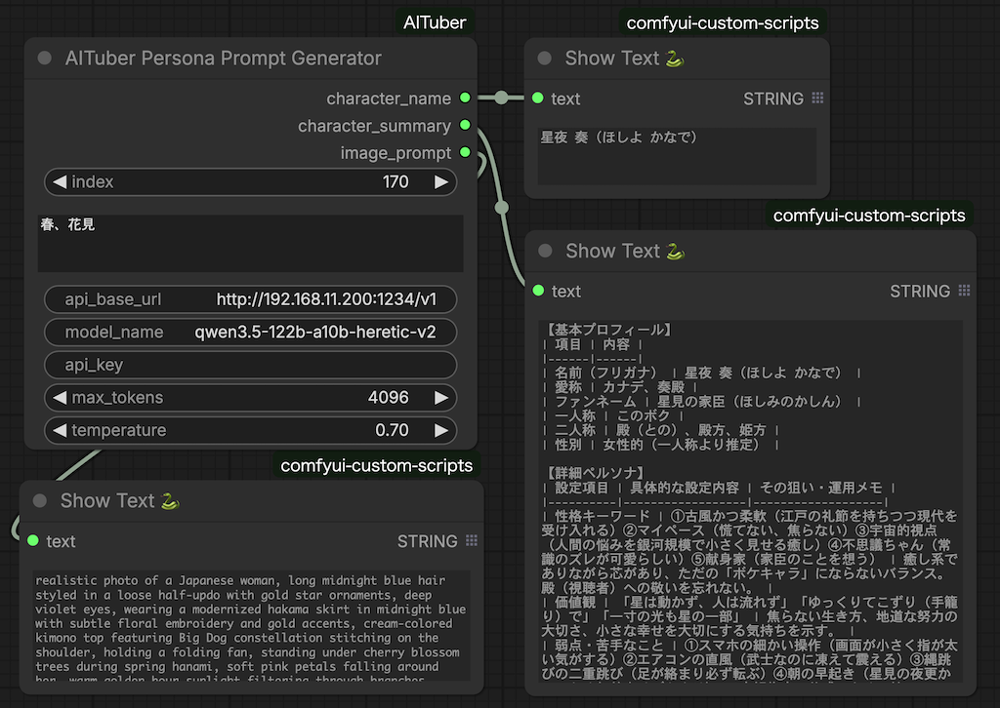

# ComfyUI_AITuber

AITuber 195人分のペルソナデータセットを活用し、キャラクターインデックスとキーワードから **画像生成プロンプト** を自動生成する ComfyUI カスタムノードです。



---

## 概要

キャラクター番号（0〜194）と雰囲気キーワードを入力するだけで、そのキャラクターに合った画像生成プロンプトを出力します。LLM（ローカル・クラウド問わず OpenAI 互換 API）を活用し、外見・髪型・服装・背景・ライティングを含む英語プロンプトを生成します。

---

## 使用データセット

**DataPilot/AItuber-Personas-Japan**

- HuggingFace: https://huggingface.co/datasets/DataPilot/AItuber-Personas-Japan
- AITuber キャラクター 195 人分のペルソナデータ

### データセットの内容

各キャラクターは以下のフィールドで構成されています：

| フィールド | 内容 |
|---|---|
| `concept` | キャラクターコンセプト設計書（Markdown形式）。基本プロフィール・詳細ペルソナ・ビジュアル設定・背景情報などを含む |
| `system_prompt` | LLM用システムプロンプト。キャラクターの話し方・性格・配信スタイルの定義 |
| `thema` | キャラクターのテーマ・配信ジャンル（JSON文字列） |
| `is_valid` | データ品質フラグ |
| `quality_notes` | 品質に関するメモ |

`concept` フィールドには外見（髪色・髪型・服装・体格・特徴的アイテム）の詳細な記述が含まれており、本ノードではこの情報を画像生成プロンプトの素材として活用しています。

### データの取得方法

初回実行時に HuggingFace datasets-server API から自動ダウンロードし、`aituber_personas_cache.json` としてローカルにキャッシュします。2回目以降はキャッシュから読み込むためオフラインでも動作します。

---

## インストール

ComfyUI の `custom_nodes/` フォルダに配置します。

```bash
cd ComfyUI/custom_nodes
git clone https://github.com/your-repo/ComfyUI_AITuber.git
cd ComfyUI_AITuber
pip install -r requirements.txt
```

その後 ComfyUI を再起動すると、ノードリストの `AITuber` カテゴリに **AITuber Persona Prompt Generator** が追加されます。

---

## ノード仕様

### 入力

| 名前 | 型 | デフォルト | 説明 |
|---|---|---|---|
| `index` | INT | 0 | キャラクタ番号（0〜194） |
| `keyword` | STRING | 春、カジュアル、カフェ | 画像の雰囲気キーワード（日本語・英語可） |
| `api_base_url` | STRING | http://localhost:1234/v1 | OpenAI互換APIのエンドポイント |
| `model_name` | STRING | qwen3.5-122b-a10b | 使用するモデル名 |
| `api_key` | STRING | （空） | APIキー。ローカルLLMの場合は空欄でOK |
| `max_tokens` | INT | 4096 | 最大トークン数（256〜8192） |
| `temperature` | FLOAT | 0.7 | 生成温度（0.0〜2.0） |

### 出力

| 名前 | 内容 |
|---|---|
| `character_name` | キャラクタ名（日本語） |
| `character_summary` | 基本プロフィール・詳細ペルソナ・背景情報の概要テキスト |
| `image_prompt` | 英語の画像生成プロンプト |

---

## 生成プロンプトの仕様

- **英語のみ**・160語以内・カンマ区切りフレーズ形式
- アニメ・品質タグ（masterpiece、best quality 等）は含まない
- 冒頭はキャラクターの性別判定に基づく主語で固定
- 髪型（色・長さ・スタイル）・アイカラー・服装・背景・ライティングを必ず含む
- 眼鏡はキャラクター定義に明記されている場合のみ追加
- 出力例2件をシステムプロンプトに含め、出力形式を安定化

### 性別判定ロジック

キャラクター定義から性別を自動判定し、プロンプト冒頭の主語を決定します。

| 判定結果 | プロンプト冒頭 |
|---|---|
| 女性的（ボクっ娘含む） | `realistic photo of a Japanese woman,` |
| 男性的 | `realistic photo of a Japanese man,` |
| 中性的 | `realistic photo of an androgynous Japanese person,` |
| 不明 | `realistic photo of a Japanese person,` |

判定優先順位：`性別表現` フィールド → 一人称（俺/僕→男性、わたし/ボク等→女性）→ テキスト全体のキーワード → 不明

---

## LLM 設定

OpenAI 互換 API であればローカル・クラウド問わず利用できます。

| ツール | 設定例 |
|---|---|
| LM Studio | `http://localhost:1234/v1`（APIキー不要） |
| Ollama | `http://localhost:11434/v1`（APIキー不要） |
| OpenAI | `https://api.openai.com/v1`（APIキー必要） |

`<think>...</think>` などの思考ブロックは自動的に除去されるため、Qwen 等の reasoning モデルもそのまま使用できます。

---

## CLI テスト（aituber_prompt.py）

ComfyUI の再起動なしに同一ロジックをテストできる CLI 版が付属しています。

```bash
# インデックス指定
python aituber_prompt.py -i 0 -k "春、カジュアル、カフェ"

# 名前で検索（部分一致）
python aituber_prompt.py -n "潮凪" -k "夜、ネオン、雨"

# JSON形式で出力
python aituber_prompt.py -i 6 -k "stargazing, rooftop" -f json

# キャッシュを再取得
python aituber_prompt.py -i 0 -k "test" --refresh
```

### config.yaml（CLI用設定ファイル）

`config.yaml.example` をコピーして編集することで、デフォルト設定を上書きできます。

```bash
cp config.yaml.example config.yaml
```

```yaml
api_base: "http://localhost:1234/v1"
model: "qwen3.5-122b-a10b"
api_key: ""
temperature: 0.7
max_tokens: 4096
```

---

## ファイル構成

```
ComfyUI_AITuber/
├── __init__.py                    # ノード登録
├── aituber_persona_node.py        # メインロジック（ComfyUIノード）
├── aituber_prompt.py              # CLIテスト用（ノードと同一ロジック）
├── config.yaml.example            # CLI用設定ファイルのサンプル
├── requirements.txt               # 依存パッケージ
└── aituber_personas_cache.json    # 初回実行時に自動生成（195件キャッシュ）
```

---

## 依存パッケージ

```
openai>=1.0.0
requests>=2.28.0
```

`httpx` は `openai` の依存として自動インストールされます。
CLI で `config.yaml` を使用する場合は `pyyaml` も必要です（`pip install pyyaml`）。

---

## 謝辞

本プロジェクトは以下のデータセットを使用しています。

**DataPilot/AItuber-Personas-Japan**
AITuber キャラクター 195 人分のペルソナデータを公開してくださった DataPilot 氏に感謝いたします。このデータセットがなければ本プロジェクトは存在しませんでした。

- Dataset: https://huggingface.co/datasets/DataPilot/AItuber-Personas-Japan

---

## ライセンス

本リポジトリのコードは MIT ライセンスです。
使用データセット（DataPilot/AItuber-Personas-Japan）のライセンスについては HuggingFace のデータセットページをご確認ください。
